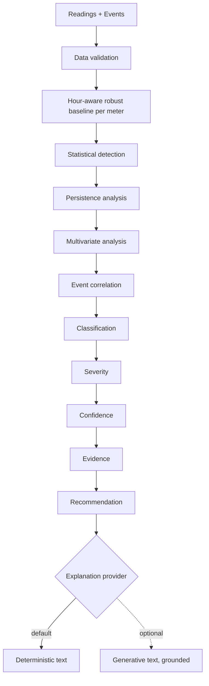

# Architecture

Approved architecture for the Bia Energy Management Platform. Product behavior is governed by `docs/product/`; decisions by `docs/adr/`; analytics semantics by `docs/ai/`. This is the target the phases build toward. Implemented so far: the runtime, the source-data schema and ingestion (Phase 01), the pure analysis engine (Phase 02), and the product API with demo login, persisted analysis runs and background orchestration (Phase 03). The frontend and explanation providers are not implemented yet.

## 1. System Context


One Go process serves the API and runs analyses in the background (ADR-001, ADR-007). The frontend is a separate Next.js application that talks only to the versioned API (ADR-005). PostgreSQL is the source of truth (ADR-003). Ollama is optional; nothing depends on it (ADR-006).

## 2. Why A Modular Monolith

The dataset is small, the team is one, the deadline is three days, and no component needs independent scaling. A monolith with strict package boundaries gives one deployable, one transaction boundary, and trivial local setup, while keeping the analysis engine pure so it can be extracted later. Microservices would add networking, deployment, and consistency costs without a requirement to justify them (ADR-001).

## 3. Boundaries

| Area | Owns | Must not |
| --- | --- | --- |
| Frontend (`src/frontend`) | Pages, UX states, charts, server-state caching (TanStack Query) | Contain analytics rules or compute classifications |
| HTTP layer (`internal/httpapi`) | Routing, request IDs, request logging, session check, input validation, status codes, the error body, DTOs and time formatting | Contain business or analytics rules; run SQL directly |
| Read services (`internal/meter`, `internal/anomaly`, `internal/dashboard`) | Current-state queries via sqlc (readings belong to `meter`; events are read by the orchestration and kept in evidence) | Duplicate engine logic or recompute findings |
| Analysis engine (`internal/analysis`, pure) | Baselines, detection, correlation, classification, severity, confidence, evidence, priority | Access database, HTTP, clock, or network |
| Run orchestration (`internal/analysisrun`) | Queue and claim runs, load inputs from PostgreSQL, invoke the engine through the `Analyzer` boundary, persist progress and results atomically; later call the `ExplanationProvider` (Phase 05) | Make classification decisions |
| Demo authentication (`internal/auth`) | One configured credential; signed session cookie (OD-12) | Store users, roles or sessions |
| Explanation providers | Turn structured evidence into text | Change any computed value |
| Platform (`internal/platform`) | Database pool, migrations, generated queries, health, source/system JSON time; metrics in Phase 06. Configuration is `internal/config`; request error mapping is `internal/httpapi` | Hold product logic |
| PostgreSQL | Integrity, filtering, sorting, aggregation | — |

Backend package layout: ADR-002.

## 4. Core Domain Concepts

| Concept | Meaning | Key fields (indicative) |
| --- | --- | --- |
| Meter | A metering point from the dataset | `meter_id`, name, location, `source_status`, `computed_status`, `created_at` |
| Reading | One hourly measurement | `meter_id`, `timestamp`, `consumption_kwh`, `voltage_v`, `current_a`, `power_factor`, `source_status` |
| Event | Known operational/data event | `meter_id`, `timestamp`, `type`, `description` |
| AnalysisRun | One execution of the pipeline | id, state, progress, started/finished, summary, error, engine config version |
| Anomaly | A classified finding of a run | id, run, `meter_id`, `detected_at`, type, severity, confidence, priority, reason, recommended action, status |
| AnomalyEvidence | Structured facts supporting a finding | baseline, observed, deviation %, signals, persistence, changed variables, correlated events, explanation source |

`source_status` comes from the CSV and is never treated as health; `computed_status` is derived from analysis results (TD-07, OD-10). The dataset provides no meter name/location; these remain nullable until a source exists.

## 5. Analytics Pipeline

Detailed semantics: `docs/ai/anomaly-analysis.md`.



Everything up to and including Recommendation is deterministic and authoritative (ADR-004). The explanation step only produces wording (ADR-006).

## 6. Analysis Run Flow

```mermaid
sequenceDiagram
  participant UI as Frontend
  participant API as Go API
  participant BG as Background run
  participant DB as PostgreSQL
  UI->>API: POST /api/v1/ai/analyze
  API->>DB: insert run QUEUED (or return the active run)
  API-->>UI: 202 {analysis_id}, Location
  API->>BG: wake-up signal
  BG->>DB: claim oldest QUEUED run (FOR UPDATE SKIP LOCKED) → RUNNING / LOADING_DATA
  BG->>DB: read readings + events (one read-only snapshot; close before computation)
  BG->>BG: engine (ANALYZING)
  BG->>DB: meter statuses + findings + COMPLETED (one transaction, PERSISTING_RESULTS)
  UI->>API: GET /api/v1/ai/analysis/{id} (poll)
  API-->>UI: status, stage, progress
  UI->>API: GET /api/v1/anomalies (latest COMPLETED run)
```

Status `QUEUED → RUNNING → COMPLETED | FAILED`. Stage `QUEUED → LOADING_DATA → ANALYZING → PERSISTING_RESULTS → COMPLETED` (or `FAILED`), progress 0/10/35/85/100 at real transitions only. There is at most one active run, and QUEUED runs survive a restart; interrupted RUNNING runs become FAILED. Details: ADR-009, which amends ADR-007.

## 7. API

Versioned under `/api/v1` and described by the canonical OpenAPI 3.1 contract [`docs/api/openapi.yaml`](../api/openapi.yaml) (TD-03). A test keeps it consistent with the router. Operational endpoints (`/healthz`, `/readyz`; `/metrics` in Phase 06) sit outside the versioned product API and are public. Every `/api/v1` route except login and logout needs the demo session cookie. Errors use one JSON body (`error.code`, `error.message`, `error.request_id`); no stack traces or internals. JSON is snake_case. Source times are written without an offset and system instants as RFC 3339 UTC.

## 8. Persistence

Relational tables for meters, readings, events (Phase 01, see [data model](data-model.md)), analysis runs, and anomalies (Phase 03); JSONB only for evidence detail. Columns that are filtered, sorted, or aggregated are real columns. Indexes follow query shapes (`docs/performance/data-query-strategy.md`). Migrations: goose, run by `cmd/migrate`. Queries: sqlc from Phase 03. Source observation times are timezone-naive (ADR-008). Ingestion is idempotent and never modifies source files.

## 9. Observability

- Structured JSON logs via `slog` with request id, route, status, duration; analysis runs log stage transitions with run id.
- `GET /healthz` (process alive) and `GET /readyz` (database reachable).
- Prometheus-compatible `/metrics`: HTTP request counts/latency, analysis run duration and outcome, explanation provider fallbacks.
- No tracing stack in the MVP.

## 10. Failure Handling Direction

- Input validation at the HTTP boundary returns 4xx with the standard error body.
- Analysis failures move the run to `FAILED` with a safe summary; partial results are never exposed.
- Runs orphaned by a crash are marked `FAILED` on startup.
- Explanation provider failure or timeout falls back to deterministic text; it never fails the run.
- Database unavailability makes readiness fail; the frontend shows recoverable error states with retry.
- Graceful shutdown cancels in-flight runs through context.

## 11. Security Posture

Intentionally minimal authentication for the challenge (OD-12): one configured demo credential compared in constant time, and an HMAC-SHA256-signed session cookie (HttpOnly, SameSite=Lax, Secure unless disabled for local HTTP, 8 hours). There are no users, roles or server-side sessions. Configuration and secrets come from environment variables, and the API refuses to start without them. SQL is always parameterized (sqlc, or explicit pgx statements for ingestion); sort keys are whitelisted. There is no CORS middleware yet: Phase 04 prefers a same-origin proxy and would add only a narrowly configured origin if needed. The LLM receives only structured evidence, never raw credentials or unrelated data.

## 12. Scalability And Evolution Paths (Not Implemented)

| Pressure | Evolution |
| --- | --- |
| Many meters / long history | Time-based partitioning of readings; then evaluate a time-series extension with measurements |
| Long or frequent analyses | Durable queue + independent analysis workers reusing the pure engine (ADR-007) |
| Continuous data | Streaming or scheduled incremental ingestion and incremental baselines |
| Multiple sites/customers | Tenant scoping in schema and API; real identity provider |

Each requires measured need and a new ADR.
