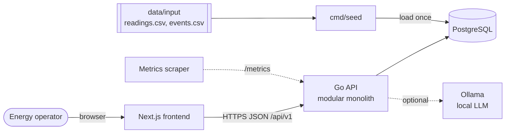
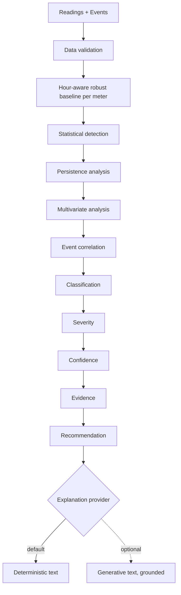
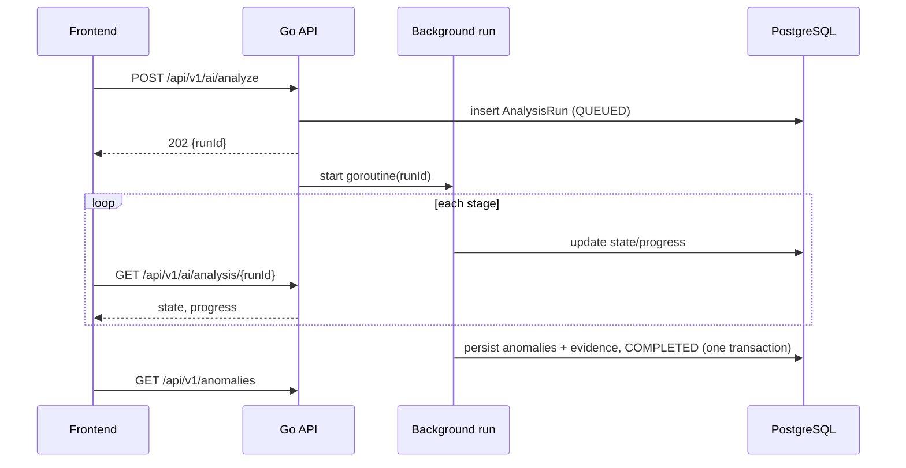

# Architecture

Approved architecture for the Bia Energy Management Platform. Product behavior is governed by `docs/product/`; decisions by `docs/adr/`; analytics semantics by `docs/ai/`. **Nothing described here is implemented yet**; this is the target the phases build toward.

## 1. System Context

One Go process serves the API and runs analyses in the background (ADR-001, ADR-007). The frontend is a separate Next.js application that talks only to the versioned API (ADR-005). PostgreSQL is the source of truth (ADR-003). Ollama is optional; nothing depends on it (ADR-006).

## 2. Why A Modular Monolith

The dataset is small, the team is one, the deadline is three days, and no component needs independent scaling. A monolith with strict package boundaries gives one deployable, one transaction boundary, and trivial local setup, while keeping the analysis engine pure so it can be extracted later. Microservices would add networking, deployment, and consistency costs without a requirement to justify them (ADR-001).

## 3. Boundaries

| Area | Owns | Must not |
| --- | --- | --- |
| Frontend (`src/frontend`) | Pages, UX states, charts, server-state caching (TanStack Query) | Contain analytics rules or compute classifications |
| HTTP layer (`internal/*` handlers) | Routing, input decoding and validation, status codes, error body | Contain business or analytics rules; run SQL directly |
| Services (`meter`, `reading`, `event`, `anomaly`, `dashboard`) | Use-case orchestration and queries via sqlc | Duplicate engine logic |
| Analysis engine (`internal/analysis`, pure) | Baselines, detection, correlation, classification, severity, confidence, evidence, priority | Access database, HTTP, clock, or network |
| Run orchestration (`internal/analysis`) | Load inputs, invoke engine, call `ExplanationProvider`, persist progress/results | Make classification decisions |
| Explanation providers | Turn structured evidence into text | Change any computed value |
| Platform (`internal/platform`) | Config, database pool, logging, health, metrics, error mapping | Hold product logic |
| PostgreSQL | Integrity, filtering, sorting, aggregation | — |

Backend package layout: ADR-002.

## 4. Core Domain Concepts

| Concept | Meaning | Key fields (indicative) |
| --- | --- | --- |
| Meter | A metering point from the dataset | `meter_id`, name, location, `source_status`, `computed_status`, `created_at` |
| Reading | One hourly measurement | `meter_id`, `timestamp`, `consumption_kwh`, `voltage_v`, `current_a`, `power_factor`, `source_status` |
| Event | Known operational/data event | `meter_id`, `timestamp`, `type`, `description` |
| AnalysisRun | One execution of the pipeline | id, state, progress, started/finished, summary, error, engine config version |
| Anomaly | A classified finding of a run | id, run, `meter_id`, `detected_at`, type, severity, confidence, priority, reason, recommended action, status |
| AnomalyEvidence | Structured facts supporting a finding | baseline, observed, deviation %, signals, persistence, changed variables, correlated events, explanation source |

`source_status` comes from the CSV and is never treated as health; `computed_status` is derived from analysis results (TD-07, OD-10). The dataset provides no meter name/location; these remain nullable until a source exists.

## 5. Analytics Pipeline

Detailed semantics: `docs/ai/anomaly-analysis.md`.

Everything up to and including Recommendation is deterministic and authoritative (ADR-004). The explanation step only produces wording (ADR-006).

## 6. Analysis Run Flow

States: `QUEUED`, `READING_DATA`, `BUILDING_BASELINES`, `DETECTING_ANOMALIES`, `CORRELATING_EVENTS`, `CLASSIFYING`, `GENERATING_EXPLANATIONS`, `COMPLETED`, `FAILED`.

## 7. API

Versioned under `/api/v1` and described with OpenAPI 3 (TD-03). Minimum surface: `docs/product/functional-requirements.md`. Operational endpoints (health, readiness, metrics) sit outside the versioned product API. Errors use one consistent JSON body with a stable code and a safe message; no stack traces.

## 8. Persistence

Relational tables for meters, readings, events, analysis runs, and anomalies; JSONB only for evidence detail. Columns that are filtered, sorted, or aggregated are real columns. Indexes follow query shapes (`docs/performance/data-query-strategy.md`). Migrations: goose. Queries: sqlc. Ingestion is idempotent and never modifies source files.

## 9. Observability

- Structured JSON logs via `slog` with request id, route, status, duration; analysis runs log stage transitions with run id.
- `GET /healthz` (process alive) and `GET /readyz` (database reachable).
- Prometheus-compatible `/metrics`: HTTP request counts/latency, analysis run duration and outcome, explanation provider fallbacks.
- No tracing stack in the MVP.

## 10. Failure Handling Direction

- Input validation at the HTTP boundary returns 4xx with the standard error body.
- Analysis failures move the run to `FAILED` with a safe summary; partial results are never exposed.
- Runs orphaned by a crash are marked `FAILED` on startup.
- Explanation provider failure or timeout falls back to deterministic text; it never fails the run.
- Database unavailability makes readiness fail; the frontend shows recoverable error states with retry.
- Graceful shutdown cancels in-flight runs through context.

## 11. Security Posture

Intentionally minimal authentication for the challenge (OD-12). Configuration and secrets come from environment variables. SQL is parameterized through sqlc. CORS is restricted to the frontend origin. The LLM receives only structured evidence, never raw credentials or unrelated data.

## 12. Scalability And Evolution Paths (Not Implemented)

| Pressure | Evolution |
| --- | --- |
| Many meters / long history | Time-based partitioning of readings; then evaluate a time-series extension with measurements |
| Long or frequent analyses | Durable queue + independent analysis workers reusing the pure engine (ADR-007) |
| Continuous data | Streaming or scheduled incremental ingestion and incremental baselines |
| Multiple sites/customers | Tenant scoping in schema and API; real identity provider |

Each requires measured need and a new ADR.
