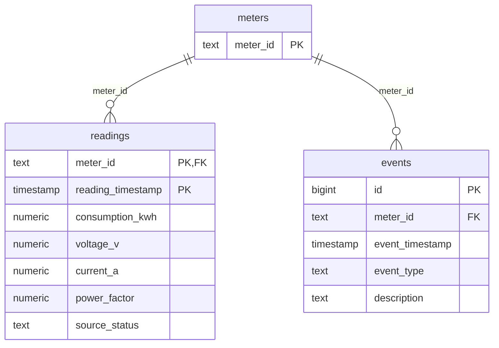
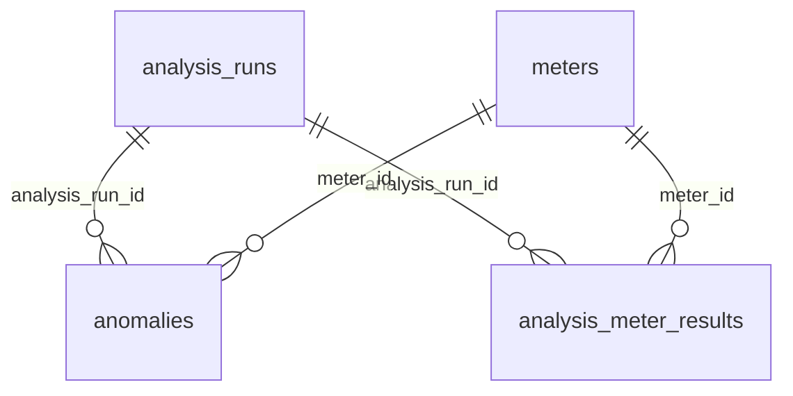

# Data Model

Source data persisted by Phase 01 and analysis results persisted by Phase 03. The schema sources of truth are `database/migrations/00001_create_source_data.sql` and `00002_create_analysis_results.sql`; this page explains them.

## Tables

| Table | Key | Integrity enforced by PostgreSQL | Notes |
| --- | --- | --- | --- |
| `meters` | `meter_id` (natural business key; primary key) | not blank | The dataset provides only identifiers; no names, locations or health are invented. Health (`computed_status`) is derived by analytics later (TD-07). |
| `readings` | `(meter_id, reading_timestamp)` primary key | FK to `meters`; all columns `NOT NULL`; measurements finite (no NaN/Infinity); `source_status` not blank | One observation per meter per hour. The primary key also serves the main query shape (meter + time range), so no extra index exists. |
| `events` | `id` identity primary key; natural key `UNIQUE (meter_id, event_timestamp, event_type, description)` | FK to `meters`; type and description not blank | `event_type` is free text, not an enum, so new types need no migration. The unique constraint's leading columns also serve meter + time lookups. |

## Semantics

- **Timestamps:** `timestamp without time zone` holding the source wall clock, with no zone invented (ADR-008).
- **Measurements:** `NUMERIC` in PostgreSQL, so decimal values are persisted and aggregated exactly. Go uses `float64`; pgx encodes floats with the shortest round-trip decimal, which reproduces the source value exactly for this data (proven for all 4,032 × 4 values by the acceptance test). Trailing zeros are not kept (`222.0` is stored as `222`); the numeric value is identical.
- **`source_status`:** the CSV `status` column, stored verbatim. It describes the source record, not meter health. In the supplied data all 4,032 rows are `OK`, including electrically inconsistent ones.
- **No physical-range checks:** negative, zero, very large or out-of-range values (such as a power factor above 1) are stored as they are. They are analytical signals for Phase 02, not ingestion errors.

## Ingestion Contract (`cmd/seed`)

1. Resolve `data/input` (flag `-input-dir` or search upward from the working directory).
2. Parse and validate both files completely before any write. Rejected:
   - a missing, duplicated or unknown header column (column order is free; a UTF-8 BOM is tolerated);
   - a wrong field count or broken quoting;
   - a blank identifier or an identifier with surrounding whitespace;
   - a missing required value;
   - an unparseable timestamp (`YYYY-MM-DD HH:MM[:SS]`, no offset);
   - a non-decimal or non-finite number (including NaN, Inf and hex forms);
   - a duplicate `(meter_id, timestamp)` reading or a duplicate event row;
   - a readings file with no data rows.

   Errors report file, line and column (up to 25, plus a count of the rest).
3. Report dataset facts: counts, readings per meter, first/last reading, hourly gaps, irregular steps, and the source status and event type distributions.
4. Load everything in one transaction using a pipelined pgx batch: meters, then readings, then events. Any failure rolls back everything.
5. The load is idempotent through the natural keys: `ON CONFLICT DO NOTHING` for meters and events; for readings, `ON CONFLICT DO UPDATE` only when a value actually changed. The result reports inserted, updated and unchanged rows per table. Re-running the same files changes nothing; there is no delete-and-reload.

Data access: the ingestion statements are hand-written, parameterized pgx statements in `internal/ingestion/store.go` (TD-18).

## Analysis Results (Phase 03)

| Table | Key | Integrity enforced by PostgreSQL | Notes |
| --- | --- | --- | --- |
| `analysis_runs` | `id` identity | Enumerations: status QUEUED/RUNNING/COMPLETED/FAILED; stage QUEUED/LOADING_DATA/ANALYZING/GENERATING_EXPLANATIONS/PERSISTING_RESULTS/COMPLETED/FAILED (Phase 05 added GENERATING_EXPLANATIONS). Ranges: progress 0–100, counts ≥ 0, aggregate confidence in [0, 1]. Consistency: FAILED ⇔ error code and message; COMPLETED/FAILED ⇔ `completed_at`; COMPLETED ⇒ result counts and progress 100 | One row per analysis, never deleted. Stores the engine version, the engine configuration snapshot (JSONB), the explanation configuration snapshot (`explanation_configuration` JSONB object: provider, model, prompt version, timeout; never a URL or secret; NULL for runs before Phase 05), source counts, findings and high-priority counts, and the mean confidence (NULL without findings). Lifecycle: ADR-009 |
| `anomalies` | `id` identity; `UNIQUE (analysis_run_id, priority)` | FKs to the run and `meters`; type, severity and status enumerations; confidence in [0, 1]; non-blank rule/action/reason; `last_observed_at >= started_at`; positive duration; evidence is a JSON object | One row per reportable finding. Filtered and sorted fields are columns; the structured evidence is JSONB (`schema_version` 1). `status` is always `OPEN`: there is no acknowledgement workflow. Phase 05 (migration 00003) adds the finding's explanation: `explanation` (JSONB object with `summary`, `why_it_matters`, `evidence_narrative`, `recommended_action_text`), `explanation_source` (DETERMINISTIC/OLLAMA), `explanation_model`, `explanation_prompt_version`, `explanation_generated_at` (timestamptz), `explanation_fallback_used` and `explanation_fallback_code` (sanitized, internal). Constraints: all provenance present together with the explanation or all NULL (findings stored before Phase 05); a model only for OLLAMA text; a fallback always DETERMINISTIC with a code |
| `analysis_meter_results` | `(analysis_run_id, meter_id)` | FKs; computed status in OK/ALERT/CRITICAL; counts ≥ 0 | The computed status of each meter as returned by the engine for each run (TD-07, OD-10), so SQL never re-derives it |

Constraints use `CHECK` rather than PostgreSQL enums, so adding a value is a one-line migration.

**Time semantics.**
- Finding episodes (`started_at`, `last_observed_at`) are source wall-clock times: `timestamp without time zone`, like readings (ADR-008).
- Run and row instants (`created_at`, `started_at`, `completed_at`) are real system instants: `timestamptz`.
- The API writes the first kind without an offset and the second as RFC 3339 UTC.

**Numbers.**
- `confidence` and `consumption_deviation_pct` are `double precision`, so the engine's `float64` values round-trip exactly.
- The evidence JSONB holds the same values in their shortest decimal form, which also round-trips exactly. This is proven for every finding of the supplied data.

**Indexes.** Each non-key index serves a named query shape:

| Index | Serves |
| --- | --- |
| `analysis_runs_single_active`: partial unique on `((true)) WHERE status IN ('QUEUED','RUNNING')` | The one-active-run guarantee (ADR-009) and the active-run lookup |
| `analysis_runs_latest_completed`: `(completed_at DESC, id DESC) WHERE status = 'COMPLETED'` | "Latest completed run", part of every current-state read |
| `anomalies_priority_per_run`: the unique constraint on `(analysis_run_id, priority)` | The findings of one run in priority order |

With a handful of runs, PostgreSQL scans these tiny tables directly (`EXPLAIN` in the Phase 03 record); the indexes matter as history grows. The reading-history query uses `readings_pkey` (meter + time range).

**Data access.**
- Product queries are SQL files in `database/queries/`, compiled by sqlc 1.31.1 into `src/backend/internal/platform/postgres/dbgen`. That code is generated; never edit it by hand. The pinned command is in the README.
- Measurements are read as `::float8`, which rounds NUMERIC to the nearest double exactly as the CSV parser does. The engine therefore gets identical inputs from the database.
- Multi-query reads run in one read-only REPEATABLE READ transaction (`postgres.ReadSnapshot`), so a page, its total and the current run are consistent.
- Analysis input uses the same snapshot helper for readings and events; the transaction ends before the engine runs. Execution provenance is refreshed atomically when a queued run is claimed (ADR-009).
