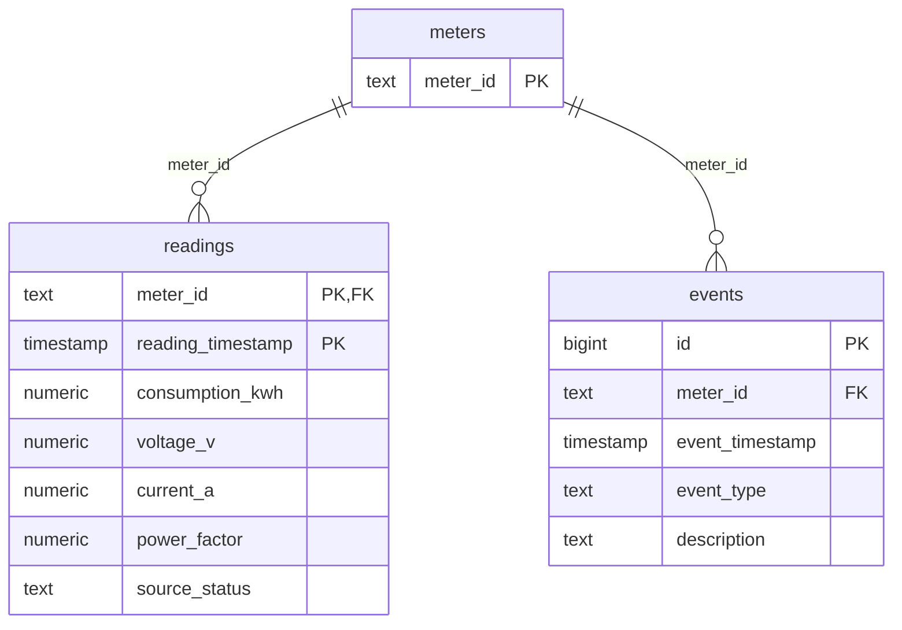

# Data Model And Ingestion (Phase 01)

Source data persisted by Phase 01. The schema source of truth is `database/migrations/00001_create_source_data.sql`; this page explains it. Analysis tables (`analysis_runs`, `anomalies`) arrive in Phase 03.

## Tables

| Table | Key | Integrity enforced by PostgreSQL | Notes |
| --- | --- | --- | --- |
| `meters` | `meter_id` (natural business key; primary key) | not blank | The dataset provides only identifiers; no names, locations or health are invented. Health (`computed_status`) is derived by analytics later (TD-07). |
| `readings` | `(meter_id, reading_timestamp)` primary key | FK to `meters`; all columns `NOT NULL`; measurements finite (no NaN/Infinity); `source_status` not blank | One observation per meter per hour. The primary key also serves the main query shape (meter + time range), so no extra index exists. |
| `events` | `id` identity primary key; natural key `UNIQUE (meter_id, event_timestamp, event_type, description)` | FK to `meters`; type and description not blank | `event_type` is free text, not an enum, so new types need no migration. The unique constraint's leading columns also serve meter + time lookups. |

## Semantics

- **Timestamps:** `timestamp without time zone` holding the source wall clock, with no zone invented (ADR-008).
- **Measurements:** `NUMERIC` in PostgreSQL, so decimal values are persisted and aggregated exactly. Go uses `float64`; pgx encodes floats with the shortest round-trip decimal, which reproduces the source value exactly for this data (proven for all 4,032 × 4 values by the acceptance test). Trailing zeros are not kept (`222.0` is stored as `222`); the numeric value is identical.
- **`source_status`:** the CSV `status` column, stored verbatim. It describes the source record, not meter health. In the supplied data all 4,032 rows are `OK`, including electrically inconsistent ones.
- **No physical-range checks:** negative, zero, very large or out-of-range values (such as a power factor above 1) are stored as they are. They are analytical signals for Phase 02, not ingestion errors.

## Ingestion Contract (`cmd/seed`)

1. Resolve `data/input` (flag `-input-dir` or search upward from the working directory).
2. Parse and validate both files completely before any write. Rejected:
   - a missing, duplicated or unknown header column (column order is free; a UTF-8 BOM is tolerated);
   - a wrong field count or broken quoting;
   - a blank identifier or an identifier with surrounding whitespace;
   - a missing required value;
   - an unparseable timestamp (`YYYY-MM-DD HH:MM[:SS]`, no offset);
   - a non-decimal or non-finite number (including NaN, Inf and hex forms);
   - a duplicate `(meter_id, timestamp)` reading or a duplicate event row;
   - a readings file with no data rows.

   Errors report file, line and column (up to 25, plus a count of the rest).
3. Report dataset facts: counts, readings per meter, first/last reading, hourly gaps, irregular steps, and the source status and event type distributions.
4. Load everything in one transaction using a pipelined pgx batch: meters, then readings, then events. Any failure rolls back everything.
5. The load is idempotent through the natural keys: `ON CONFLICT DO NOTHING` for meters and events; for readings, `ON CONFLICT DO UPDATE` only when a value actually changed. The result reports inserted, updated and unchanged rows per table. Re-running the same files changes nothing; there is no delete-and-reload.

Data access: the ingestion statements are hand-written, parameterized pgx statements in `internal/ingestion/store.go`. sqlc is introduced in Phase 03 for product read queries (TD-18).
